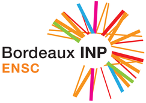

Programmation orientée objet en C#
=====

Ce livre est un support de cours à l'[Ecole Nationale Supérieure de Cognitique](https://ensc.bordeaux-inp.fr).

## Résumé

Ce livre est une introduction à la **programmation orientée objet** (POO). Il présente de manière progressive et illustrée les concepts essentiels et les savoir-faire associés :

* Ecriture et utilisation de classes.
* Ajout de constructeurs et d'accesseurs, encapsulation.
* Gestion des objets en mémoire (notion de référence d'objet).
* Mise en relation de classes : association et héritage.
* Redéfinition et surcharge de méthodes, membres statiques.
* Gestion des exceptions.

Les exemples de code associés sont [disponibles en ligne](https://github.com/bpesquet/poo-csharp/tree/master/examples). Ils sont écrits en C# mais facilement transposables à d'autres langages orientés objet comme Java.

## Pré-requis

La lecture de ce livre nécessite une connaissance des bases de la programmation :

* Notions de variable et de type.
* Structures conditionnelles et itératives (boucles).
* Programmation modulaire (sous-programmes) et passage de paramètres.
* Tableaux et listes.

## Contributions

Ce livre est publié sous la licence Creative Commons [BY-NC-SA](http://creativecommons.org/licenses/by-nc-sa/4.0/). Son code source est disponible sur [GitHub](https://github.com/bpesquet/poo-csharp). N'hésitez pas à contribuer à son amélioration en utilisant les *issues* pour signaler des erreurs et les *pull requests* pour proposer des ajouts.

Merci d'avance et bonne lecture !
