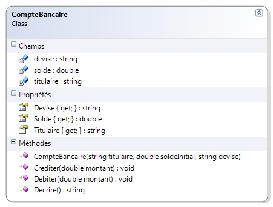
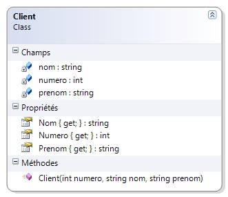
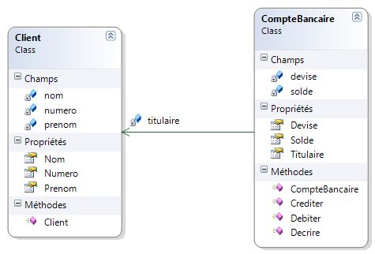
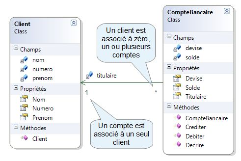

# La relation d'association

L'objectif de ce chapitre est de découvrir pourquoi et comment mettre des objets en relation les uns avec les autres.

## Introduction aux relations entre objets

### Le besoin de relations

Comme nous l'avons déjà vu, la programmation orientée objet consiste à concevoir une application sous la forme de "briques" logicielles appelées des objets. Chaque objet joue un rôle précis et peut communiquer avec les autres objets. Les interactions entre les différents objets vont permettre à l'application de réaliser les fonctionnalités attendues.

Nous savons qu'un **objet** est une entité qui représente (modélise) un élément du domaine étudié : une voiture, un compte bancaire, un nombre complexe, une facture, etc. Un objet est toujours créé d'après un modèle, qui est appelé sa **classe**.

Sauf dans les cas les plus simples, on ne pourra pas modéliser fidèlement le domaine étudié en se contentant de concevoir une seule classe. Il faudra définir plusieurs classes et donc instancier des objets de classes différentes. Cependant, ces objets doivent être mis en relation afin de pouvoir communiquer.

### Contexte d'exemple

Reprenons notre classe modélisant un compte bancaire, issue d'un précédent chapitre.



```csharp
public class CompteBancaire
{
    private string titulaire;
    private double solde;
    private string devise;

    public CompteBancaire(string leTitulaire, double soldeInitial, string laDevise)
    {
        titulaire = leTitulaire;
        solde = soldeInitial;
        devise = laDevise;
    }

    public string Titulaire
    {
        get { return titulaire; }
    }

    public double Solde
    {
        get { return solde; }
    }

    public string Devise
    {
        get { return devise; }
    }

    public void Crediter(double montant)
    {
        solde += montant;
    }

    public void Debiter(double montant)
    {
        solde -= montant;
    }

    public string Decrire()
    {
        return "Le solde du compte de " + titulaire + " est de " + solde + " " + devise;
    }
}
```

On souhaite à présent enrichir notre modélisation orientée objet en incluant des informations détaillées sur le titulaire d'un compte : son nom, son prénom, son numéro de client.

Une première idée serait d'ajouter dans notre classe les attributs correspondants. C'est une mauvaise idée : les données d'un client seraient dupliquées dans chacun de ses comptes. Et le rôle de la classe `CompteBancaire` est de modéliser un compte, pas un client.

La bonne solution est de créer une nouvelle classe représentant un client.



On retrouve dans cette classe, sous forme d'attributs, les données caractérisant un client : numéro, nom et prénom. On pourra ensuite instancier des objets de cette classe pour représenter les clients d'une banque.

```csharp
Client pierre = new Client(123456, "Kiroul", "Pierre");
Client paul = new Client(987654, "Ochon", "Paul");
```

A ce stade, nous avons d'un côté des comptes, de l'autre des clients, mais pas encore de relations entre eux. Plus précisément, il faudrait pouvoir modéliser l'information "ce compte a pour titulaire ce client". Pour cela, on modifie le type de l'attribut titulaire dans `CompteBancaire` : on remplace le type `string` par le type `Client`.

```csharp
class CompteBancaire
{
    private Client titulaire;  // type string => type Client

    // ...

    public CompteBancaire(Client leTitulaire, double soldeInitial, string laDevise)
    {
       titulaire = leTitulaire;
       solde = soldeInitial;
       devise = laDevise;
    }

    public Client Titulaire
    {
        get { return titulaire; }
    }

    // ...
```

La création d'un nouveau compte nécessite de passer en paramètre le client titulaire.

```csharp
Client pierre = new Client(123456, "Kiroul", "Pierre");
Client paul = new Client(987654, "Ochon", "Paul");

CompteBancaire compte1 = new CompteBancaire(pierre, 500, "euros");
CompteBancaire compte2 = new CompteBancaire(paul, 1000, "euros");

Console.WriteLine("N° du titulaire du compte 1 : " + compte1.Titulaire.Numero);
Console.WriteLine("Nom du titulaire du compte 2 : " + compte2.Titulaire.Nom);
```


La propriété C# `Titulaire` de la classe `CompteBancaire` renvoie une instance de la classe `Client`. On peut ensuite utiliser ses propriétés et ses méthodes, comme pour n'importe quel autre objet.

On souhaite à présent afficher la description de chaque compte.

```csharp
Client pierre = new Client(123456, "Kiroul", "Pierre");
Client paul = new Client(987654, "Ochon", "Paul");

CompteBancaire compte1 = new CompteBancaire(pierre, 500, "euros");
CompteBancaire compte2 = new CompteBancaire(paul, 1000, "euros");

Console.WriteLine(compte1.Decrire());
Console.WriteLine(compte2.Decrire());
```


Le résulta d'exécution ci-dessus est étrange mais logique. Pour le comprendre, revenons au code source de la méthode `Decrire`.

```csharp
public string Decrire()
{
    string description = "Le solde du compte de " + titulaire + " est de " + solde + " " + devise;
    return description;
}
```

Ici on concatène l'attribut `Titulaire`, instance de la classe `Client`, à une chaîne de caractères pour créer la description du compte. Le langage C# ne sait pas comment représenter un client sous forme textuelle et il renvoie le nom complet de la classe `Client` (ici, `Association` correspond à l'espace de noms dont lequel est définie la classe `Client`). Il est donc nécessaire de modifier la méthode `Decrire` afin d'afficher toutes ses propriétés.

```csharp
public string Decrire()
{
    string descriptionTitulaire = titulaire.Prenom + " " + titulaire.Nom;
    string description = "Le solde du compte de " + descriptionTitulaire + " est de " + solde + " " + devise;
    return description;
}
```


**REMARQUE** : il existe une autre solution pour obtenir une représentation textuelle d'un objet. Elle sera étudiée prochainement.

Dans cet exemple, on a mis en relation un objet de la classe `CompteBancaire` avec un objet de la classe `Client`. En terminologie objet, on dit qu'on a créé une **association** entre les deux classes.

## Associations entre classes

### Définition

L'exemple précédent a permis de mettre en relation un compte bancaire et son client titulaire. Grâce à cette association, nous avons modélisé la relation "un compte bancaire a un titulaire".

**DEFINITION** : une **association** modélise une relation entre classes de type **"a un"** ou **"a plusieurs"**. Un compte bancaire *a un* titulaire, un livre *a plusieurs* pages, etc.

**AVERTISSEMENT** : ne pas confondre avec une relation de type **"est un"**, modélisée par **l'héritage** (voir chapitre suivant).

On la représente graphiquement en UML par un trait continu entre les deux classes concernées.



On observe que l'attribut `Titulaire` de `CompteBancaire` n'est plus listé dans cette classe, mais représenté au-dessus du trait d'association, côté classe `Client`. Il s'agit du **rôle** que jouent les instances de `Client` dans l'association : un client est le titulaire d'un compte bancaire.

La flèche qui pointe vers `Client` indique le sens de **navigation** de l'association.

Une relation d'association implique un lien entre les classes concernées. Elles ne peuvent plus fonctionner indépendamment l'une de l'autre. On parle également de **couplage** entre les classes.

### Multiplicités d'une association

Notre définition de la classe `CompteBancaire` implique qu'un objet de cette classe a un et un seul titulaire. En revanche, rien n'empêche que plusieurs comptes bancaires aient le même client comme titulaire.

Autrement dit, notre modélisation conduit aux règles ci-dessous :

* une instance de `CompteBancaire` est associée à une seule instance de `Client`.
* une instance de `Client` peut être associée à un nombre quelconque d'instances de `CompteBancaire`.

Cela se représente graphiquement par l'ajout de **multiplicités** à chaque extrémité de l'association.



**DEFINITION** : la **multiplicité** située à une extrémité d'une association UML indique **à combien d'instances de la classe une instance de l'autre classe peut être liée**.

**ATTENTION** : les multiplicités UML se lisent dans le sens **inverse** des cardinalités Merise.

Le tableau ci-dessous rassemble les principales multiplicités utilisées en UML.

| Multiplicité | Signification |
|--------------|---------------|
| *0..1* | Zéro ou un |
| *1* | Un |
| *\** | De zéro à plusieurs |
| *1..\** | De un à plusieurs |

**DEFINITION** : la multiplicité par défaut (en l'absence de mention explicite à l'extrémité d'une association) est **1**.

En étudiant leurs multiplicités, on peut trouver la sémantique des associations ci-dessous.


* Une personne possède **zéro ou plusieurs** ordinateurs.
* Un ordinateur appartient à **une ou plusieurs** personnes.


* Une personne possède **zéro ou un** ordinateur.
* Un ordinateur appartient à **une** personne.

### Navigabilité d'une association

Revenons à notre exemple des comptes bancaires associés à leur titulaire.


A partir d'une instance de la classe `CompteBancaire`, il est possible d'accéder à son titulaire, instance de la classe `Client`. Par contre, à partir d'une instance de `Client`, rien ne permet de retrouver les comptes dont il est titulaire. L'association entre `CompteBancaire` et `Client` ne peut être *naviguée* que dans un seul sens, de `CompteBancaire` vers `Client`.

**DEFINITION** : une association navigable dans un seul sens est une association **unidirectionnelle**.

Dans le diagramme UML, le sens de navigation est exprimé par une **flèche** qui pointe vers la classe vers laquelle on peut naviguer (ici la classe `Client`).

**AVERTISSEMENT** : ne pas confondre la flèche de la navigabilité unidirectionnelle avec la flèche pleine de l'héritage.

On pourrait souhaiter que l'association soit également navigable mais dans le sens inverse, c'est-à-dire qu'on puisse retrouver les comptes dont un client est titulaire. Pour cela, il faut modifier la classe `Client`. Il est nécessaire d'y ajouter un attribut qui stockera les comptes bancaires dont un client est titulaire. Comme un client peut être titulaire de plusieurs comptes, cet attribut sera une liste d'instances de la classe `CompteBancaire`.

```csharp
public class Client
{
    // ...
    private List<CompteBancaire> comptes;

    public Client(int numero, string nom, string prenom)
    {
        comptes = new List<CompteBancaire>();
        // ...
    }

    public List<CompteBancaire> Comptes
    {
        get { return comptes; }
    }

    // ...
```

L'utilisation des classes reflète les changements effectués : il faut maintenant ajouter à un client les comptes dont il est titulaire.

```csharp
Client pierre = new Client(123456, "Kiroul", "Pierre");
Client paul = new Client(987654, "Ochon", "Paul");

// association entre pierre et compte1
CompteBancaire compte1 = new CompteBancaire(pierre, 500, "euros");
pierre.Comptes.Add(compte1);

// association entre paul et compte2
CompteBancaire compte2 = new CompteBancaire(paul, 1000, "euros");
paul.Comptes.Add(compte2);
```

**DEFINITION** : une association navigable dans les deux sens est une association **bidirectionnelle**.

Dans un diagramme de classes UML, l'absence de flèche sur le lien d'association indique qu'elle est bidirectionnelles et donc navigable dans les deux sens.


**CONSEIL** : en pratique, une association bidirectionnelle est plus complexe à coder : il faut penser à mettre à jour les attributs de chaque classe pour qu'elle reste cohérente. On privilégiera le plus souvent les associations unidirectionnelles en choisissant le sens de navigation le plus utile.

## Types particuliers d'associations

### L'agrégation

Prenons l'exemple d'un courier électronique (courriel). Il peut éventuellement contenir une ou plusieurs pièces jointes. Les pièces jointes font partie du courriel. Un courriel et ses pièces jointes sont liés par une relation de type "se compose de", "composant/composé" ou encore "tout/partie".

Dans le cadre d'une modélisation objet, on représente cette association particulière par un lien dont une extrémité (celle du composé) comporte un losange vide. On la nomme **agrégation**.


**DEFINITION** : une **agrégation** est une association qui modélise une relation "se compose de".

**REMARQUES**

* Un composant (ici, une pièce jointe) peut être partagé par plusieurs composés (ici, des courriels).
* La traduction en code source d'une agrégation est identique à celle d'une association.

### La composition

Un livre se compose d'un certain nombre de pages. On pourrait modéliser le lien livre-page par une agrégation. Cependant, les cycles de vie des objets associés sont liés : si un livre disparaît, toutes les pages qui le composent disparaissent également. Ce n'est pas le cas pour l'exemple précédent : une pièce jointe n'est pas détruite si le courriel auquel elle est jointe disparaît.

Pour traduire une relation composant/composé dont les cycles de vie sont liés, on représente l'association correspondante avec un losange plein du côté du composé. On la nomme **composition**.


**DEFINITION** : une **composition** est une agrégation entre objets dont les cycles de vie sont liés.

**REMARQUES**

* Un composant (ici, une page) ne peut pas être partagé par plusieurs composés (ici, des livres). Par conséquent, la multiplicité côté composé est toujours *1*.
* La traduction en code source d'une composition ressemble à celle d'une agrégation. Comme les cycles de vie des objets sont liés, les composants sont parfois instanciés par le constructeur du composé.

## Traduction en code d'une association

Une association entre deux classes se traduit par l'ajout d'attributs. Les classes associées possèdent en attribut une ou plusieurs références vers l'autre classe.

La présence ou l'absence de références dans une classe dépend de la **navigabilité** de l'association. Si des références sont présentes, leur nombre dépend des **multiplicités** de l'association.

Soit le diagramme UML ci-dessous.


L'association est navigable de `Ordinateur` vers `Personne`. Il y aura donc une ou plusieurs références à `Personne` dans la classe `Ordinateur`, mais pas de référence à `Ordinateur` dans la classe `Personne`.

La multiplicité au niveau de `Personne` est la multiplicité par défaut, *1*. Un ordinateur appartient à une et une seule personne. Il y a aura donc une référence à `Personne` dans la classe `Ordinateur`. Afin de respecter le rôle défini pour la classe `Personne` dans l'association, l'attribut correspondant est nommé `proprietaire`.

```csharp
class Ordinateur
{
    private Personne proprietaire;
    // ...
```

**DEFINITION** : une multiplicité *1* ou *0..1* se traduit par l'ajout d'une seule référence comme attribut.

Soit le diagramme UML ci-dessous.


L'association est navigable de `Livre` vers `Page`. Il y aura donc une ou plusieurs références à `Page` dans la classe `Livre`, mais pas de référence à `Livre` dans la classe `Page`.

La multiplicité au niveau de `Page` est *1..\**. Un livre est composé de une ou plusieurs pages. L'attribut ajouté dans `Livre` doit permettre de stocker un nombre quelconque d'instances de `Page`. On utilise donc une liste d'objets de type `Page`. Afin de respecter le rôle défini pour la classe `Page` dans l'association, l'attribut correspond est nommé `pages`.

```csharp
class Livre
{
    private List<Page> pages;
    // ...
```

**DEFINITION** : une multiplicité \* ou 1..* se traduit par l'ajout d'une liste de références comme attribut.
