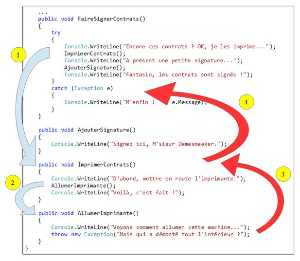
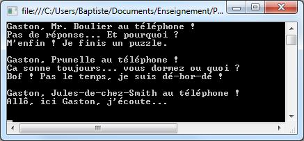
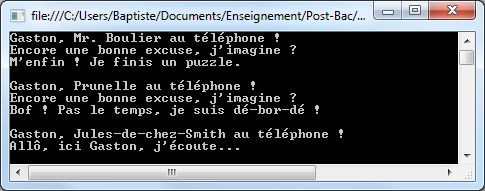

# Gestion des exceptions

L'objectif de ce chapitre est de se familiariser avec le mécanisme de gestion des exceptions.

## Introduction : qu'est-ce qu'une exception ?

Commençons ce chapitre par une définition.

**DEFINITION** : une exception est un évènement qui apparaît pendant le déroulement d'un programme et qui empêche la poursuite normale de son exécution.

Autrement dit, une exception représente un problème qui survient dans un certain contexte : base de données inaccessible, mauvaise saisie utilisateur, fichier non trouvé... Comme son nom l'indique, une exception traduit un évènement exceptionnel et a priori imprévisible. Pour essayer de répondre à ce problème, le programmeur doit mettre en place un mécanisme de gestion des exceptions.

La suite de ce chapitre utilise le langage C#, mais presque tous les concepts étudiés se retrouvent dans d'autres langages comme Java.

## Fonctionnement général des exceptions

### Contexte choisi

Pour illustrer le fontionnement des exceptions en C#, nous allons prendre exemple sur le plus célèbre des gaffeurs (© Marsu Productions).


Nous allons modéliser Gaston sous la forme d'une classe dont les méthodes reflèteront le comportement.

**REMARQUE** : afin de vous permettre d'identifier le moment où se produisent des exceptions , les méthodes de cet exemple affichent les messages sur la sortie standard (`Console.WriteLine`). En règle générale, cette pratique est déconseillée.

### Un premier exemple

Pour commencer, ajoutons à Gaston la capacité (limitée...) de trier le courrier en retard.

```csharp
public class GastonLagaffe
{
    public void TrierCourrierEnRetard(int nbLettres)
    {
        Console.Write("Quoi, " + nbLettres + " lettre(s) à trier ? ");
        try
        {
            Console.WriteLine("OK, OK, je vais m'y mettre...");
            if (nbLettres > 2)
            {
                throw new Exception("Beaucoup trop de lettres...");
            }
            Console.WriteLine("Ouf, j'ai fini.");
        }
        catch (Exception e)
        {
            Console.WriteLine("M'enfin ! " + e.Message);
        }
        Console.WriteLine("Après tout ce travail, une sieste s'impose.");
    }
}
```

Le programme principal demande à Gaston de trier deux lettres. Exécutons-le.

```csharp
GastonLagaffe gaston = new GastonLagaffe();
Console.WriteLine("Debout Gaston ! Il faut trier le courrier !");
gaston.TrierCourrierEnRetard(2);
```


Modifions notre programme principal afin de demander à Gaston de trier trois lettres.

```csharp
// ...
gaston.trierCourrierEnRetard(3);
```

Nous obtenons cette fois-ci un résultat bien différent.


### Analyse de l'exemple

La capacité de travail de Gaston étant limitée, celui-ci est incapable de trier plus de deux lettres en retard. Comme le résultat de l'exécution nous le montre, le début de l'appel de la méthode `TrierCourrierEnRetard` avec trois lettres s'est déroulé normalement.

```csharp
Console.Write("Quoi, " + nbLettres + " lettre(s) à trier ? ");
try
{
    Console.WriteLine("OK, OK, je vais m'y mettre...");
    // ...
```

Ensuite, le test ci-dessous a déclenché ce qu'on appelle la **levée** d'une exception.

```csharp
    // ...
    if (nbLettres > 2)
    {
        throw new Exception("Beaucoup trop de lettres...");
    }
    // ...
```

On remarque que cette levée d'exception a interrompu le déroulement du reste de la méthode (absence de l'affichage "Ouf, j'ai fini"). En revanche, nous obtenons le message "M'enfin ! Beaucoup trop de lettres", qui provient du bloc de code `catch`.

```csharp
    // ...
    catch (Exception e)
    {
        Console.WriteLine("M'enfin ! " + e.Message);
    }
    // ...
```

Cela signifie que l'exception levée a été **interceptée** dans ce bloc de code, déclenchant l'affichage du message d'erreur. Pour terminer, on observe que la dernière instruction de la méthode a malgré tout été exécutée.

```csharp
    // ...
    Console.WriteLine("Après tout ce travail, une sieste s'impose.");
}
```

### Conclusion provisoire

Nous avons découvert de nouveaux mots-clés qui permettent la gestion des exceptions en C# :

* `try` délimite un bloc de code dans lequel des exceptions peuvent se produire.
* `catch` délimite un bloc de code qui intercepte et gère les exceptions levées dans le bloc `try` associé.
* `throw` lève une nouvelle exception.

La syntaxe générale de la gestion des exceptions est la suivante.

```csharp
try
{
    // code susceptible de lever des exceptions
}
catch (Exception e)
{
    // code de gestion de l'exception qui s'est produite dans le bloc try
}
```

Il s'agit d'une première approche très simpliste. Il nous reste de nombreux points à examiner.

## Détail du fonctionnement des exceptions

### Une exception est un objet

Intéressons-nous à la partie du code précédent qui lève une exception.

```csharp
// ...
throw new Exception("Beaucoup trop de lettres...");
// ...
```

On voit que l'exception est **instanciée** comme un objet classique grâce au mot-clé `new`, puis levée (ou encore "jetée") grâce au mot-clé `throw`. On aurait pu décomposer le code ci-dessus de la manière suivante (rarement utilisée en pratique).

```csharp
// ...
Exception exception = new Exception("Beaucoup trop de lettres...");
throw exception;
// ...
```

Analysons le contenu du bloc `catch`.

```csharp
// ...
catch (Exception e)
{
    Console.WriteLine("M'enfin ! " + e.Message);
}
// ...
```

On observe que la variable `e` utilisée est en réalité un **objet**, instance de la classe `Exception`. On constate que cette classe dispose (entre autres) d'une propriété C# nommée `Message`, qui renvoie le message véhiculé par l'exception.

La classe `Exception` propose également des méthodes comme `ToString`, qui renvoient des informations plus détaillées sur l'erreur.

### Une exception remonte la chaîne des appels

Dans l'exemple précédent, nous avons intercepté dans le programme principal une exception levée depuis une méthode. Découvrons ce qui se produit lors d'un appel de méthodes en cascade.

Pour cela, on ajoute plusieurs méthodes à la classe `GastonLagaffe`.

```csharp
public class GastonLagaffe
{
    // ...
    public void FaireSignerContrats()
    {
        try
        {
            Console.WriteLine("Encore ces contrats ? OK, je les imprime...");
            ImprimerContrats();
            Console.WriteLine("A présent une petite signature...");
            AjouterSignature();
            Console.WriteLine("Fantasio, les contrats sont signés !");
        }
        catch (Exception e)
        {
            Console.WriteLine("M'enfin ! " + e.Message);
        }
    }

    public void AjouterSignature()
    {
        Console.WriteLine("Signez ici, M'sieur Demesmaeker.");
    }

    public void ImprimerContrats()
    {
        Console.WriteLine("D'abord, mettre en route l'imprimante.");
        AllumerImprimante();
        Console.WriteLine("Voilà, c'est fait !");
    }

    public void AllumerImprimante()
    {
        Console.WriteLine("Voyons comment allumer cette machine...");
        throw new Exception("Mais qui a démonté tout l'intérieur ?");
    }
}
```

On modifie également le programme principal pour demander à Gaston de faire signer les contrats.

```csharp
GastonLagaffe gaston = new GastonLagaffe();
Console.WriteLine("Gaston, Mr, Demesmaeker arrive, faites vite !");
gaston.FaireSignerContrats();
```

Le résultat de l'exécution est donné ci-après.


On constate que l'exception levée dans la méthode `AllumerImprimante` a été propagée par la méthode `ImprimerContrats` puis finalement interceptée dans le bloc `catch` de la méthode `FaireSignerContrats`.



Une exception levée remonte la chaîne des appels dans l'ordre inverse, jusqu'à être interceptée dans un bloc `catch`. Dans le cas où aucun gestionnaire d'exception n'est trouvé, l'exécution du programme s'arrête avec un message d'erreur. Pour le constater, on modifie le programme principal pour faire appel à une méthode qui lève une exception.

```csharp
// ...
gaston.AllumerImprimante();
```

On obtient cette fois-ci une erreur à l'exécution.


**DANGER** ! Une exception non interceptée provoque un arrêt brutal de l'exécution d'un programme.

### Les exceptions forment une hiérarchie

Jusqu'à présent, nous avons utilisé uniquement la classe C# standard `Exception` pour véhiculer nos exceptions. Il est possible de dériver cette classe afin de créer nos propres classes d'exception. Voici le diagramme de classes UML associé.


La valeur ajoutée de ces classes se limite à la modification du message d'erreur de l'exception.

```csharp
public class ExceptionMenfin : Exception
{
    public ExceptionMenfin(string message) : base("M'enfin ! " + message)
    { }
}
```

```csharp
public class ExceptionBof : Exception
{
    public ExceptionBof(string message) : base("Bof ! " + message)
    { }
}
```

On ajoute à notre classe `GastonLagaffe` la capacité de répondre (ou pas...) au téléphone.

```csharp
public class GastonLagaffe
{
    // ...

    public void RepondreAuTelephone(string appelant)
    {
        if (appelant == "Mr. Boulier")
        {
            throw new ExceptionMenfin("Je finis un puzzle.");
        }
        else if (appelant == "Prunelle")
        {
            throw new ExceptionBof("Pas le temps, je suis dé-bor-dé !");
        }
        else
        {
            Console.WriteLine("Allô, ici Gaston, j'écoute...");
        }
    }
}
```

On ajoute au programme principal un sous-programme qui appelle cette méthode et intercepte les éventuelles exceptions.

```csharp
// ...
private static void GererAppel(GastonLagaffe gaston, string appelant)
{
    Console.WriteLine("Gaston, " + appelant + " au téléphone !");
    try
    {
        gaston.RepondreAuTelephone(appelant);
    }
    catch (ExceptionMenfin e)
    {
        Console.WriteLine("Pas de réponse... Et pourquoi ?");
        Console.WriteLine(e.Message);
    }
    catch (ExceptionBof e)
    {
        Console.WriteLine("Ca sonne toujours... vous dormez ou quoi ?");
        Console.WriteLine(e.Message);
    }
    Console.WriteLine();
}
```

Enfin, le programme principal appelle ce sous-programme plusieurs fois.

```csharp
GastonLagaffe gaston = new GastonLagaffe();

GererAppel(gaston, "Mr. Boulier");
GererAppel(gaston, "Prunelle");
GererAppel(gaston, "Jules-de-chez-Smith");
```

Le résultat de l'exécution est présenté ci-dessous.



On constate que l'exception de type `ExceptionMenfin` a été interceptée dans le premier bloc `catch`, et l'exception de type `ExceptionBof` a été interceptée dans le second.

Comme nos exceptions héritent toutes deux de la classe `Exception`, il est possible de simplifier l'appel en interceptant uniquement `Exception`.

```csharp
// ...
private static void GererAppel(GastonLagaffe gaston, string appelant)
{
    Console.WriteLine("Gaston, " + appelant + " au téléphone !");
    try
    {
        gaston.RepondreAuTelephone(appelant);
    }
    catch (Exception e)  // on intercepte uniquement Exception
    {
        Console.WriteLine("Encore une bonne excuse, j'imagine ?");
        Console.WriteLine(e.Message);
    }
    Console.WriteLine();
}
```

Le résultat de l'exécution est maintenant le suivant.



Afin de limiter le nombre de blocs `catch`, on peut donc intercepter une superclasse commune à plusieurs exceptions. C'est particulièrement intéressant dans le cas où le traitement de l'erreur est le même dans tous les `catch`. En revanche, intercepter une superclasse plutôt que les classes dérivées fait perdre l'information sur le type exact de l'exception. Dans l'exemple précédent, on ne sait plus si l'exception interceptée est une `ExceptionMenfin` ou une `ExceptionBof`. Quand le traitement doit être différencié selon le type de l'erreur rencontrée, il faut donc ajouter autant de blocs `catch` que de types d'exception.

## Avantages apportés par les exceptions

Il existe d'autres solutions que l'utilisation des exceptions pour gérer les erreurs qui peuvent se produirent durant l'exécution d'un programme. Cependant, les exceptions apportent de nombreux avantages. Le principal est qu'elles permettent de regrouper et de différencier le code de gestion des erreurs du code applicatif.

Sans utiliser d'exceptions, on est obligé de tester la réussite de chaque opération au fur et à mesure du déroulement. Par exemple, une méthode d'écriture dans un fichier pourrait s'écrire comme ci-dessous.

```text
public void EcrireDansFichier(string texte)
{
    <ouverture du fichier en écriture>
    if <ouverture en écriture ok>
    {
        <écriture du texte dans le fichier>
        if <écriture du texte ok>
        {
            <fermeture du fichier>
            if <fermeture ok>
            {
                <affichage message : succès>
            }
            else
            {
                <affichage message : erreur de fermeture>
            }
        }
        else
        {
            <affichage message : erreur d'écriture>
        }
    }
    else
    {
        <affichage message : impossible d'ouvrir le fichier>
    }
}
```

Réécrit en utilisant des exceptions, ce code pourrait devenir :

```text
public void EcrireDansFichier(string texte)
{
    try
    {
        <ouverture du fichier en écriture>
        <écriture du texte dans le fichier>
        <fermeture du fichier>
        <affichage message : succès>
    }
    catch (<exception de type ouverture impossible>)
    {
        <affichage message : impossible d'ouvrir le fichier>
    }
    catch (<exception de type écriture impossible>)
    {
        <affichage message : erreur d'écriture>
    }
    catch (<exception de type fermeture impossible>)
    {
        <affichage message : erreur de fermeture>
    }
}
```

Cette solution sépare le code applicatif du code de gestion des erreurs, regroupé dans les `catch`. Si la gestion des erreurs est la même dans tous les blocs `catch`, on peut même simplifier encore le code précédent.

```text
public void EcrireDansFichier(string texte)
{
    try
    {
        <ouverture du fichier en écriture>
        <écriture du texte dans le fichier>
        <fermeture du fichier>
        <affichage message : succès>
    }
    catch (<exception la plus générale>)
    {
        <affichage message véhiculé par l'exception>
    }
}
```

## Bonnes pratiques dans la gestion des exceptions

Comme nous l'avons vu, les exceptions constituent une nette amélioration pour gérer les erreurs, à condition de savoir les employer correctement.

### Savoir quand lever une exception

La première règle, et probablement la plus importante, est que l'usage des exceptions doit rester réservé aux cas exceptionnels (comme leur nom l'indique).

**IMPORTANT** : une méthode ne lève une exception qu'en dernier recours pour signaler qu'elle est incapable de continuer à s'exécuter normalement.

Par exemple, on pourrait avoir la mauvaise idée d'employer les exceptions comme ci-dessous, pour sortir d'une boucle.

```csharp
i = 0;
trouve = false;
while (!trouve)
{
    i++;
    if (i == 10)
        throw new Exception("Fin de la boucle");
    else
        // ...
}
```

Ecrire ce genre de code est très maladroit pour plusieurs raisons :

* il ne correspond pas à la philosophie des exceptions, à savoir la gestion des erreurs,
* il rend le code moins lisible et son exécution difficile à prévoir,
* il est beaucoup plus lent : lever une exception est un processus coûteux en temps d'exécution.

### Savoir quand intercepter une exception

Une exception signale une erreur rencontrée durant l'exécution et remonte la chaîne des appels de méthode jusqu'à son interception (ou le "plantage" du programme). Il faut bien réfléchir avant de lancer une exception depuis une méthode, et également avant de l'intercepter dans une autre méthode.

**IMPORTANT** : une méthode n'intercepte une exception que si elle est capable d'effectuer un traitement approprié (message d'erreur, nouvelle tentative, etc).

Dans le cas contraire, il vaut mieux laisser l'exception se propager plus haut dans la chaîne des appels. Il ne sert strictement à rien d'intercepter une exception sans savoir quoi en faire, comme par exemple dans le code ci-dessous.

```csharp
try
{
    // code susceptible de lever des exceptions
}
catch (Exception e)  // ce bloc catch est parfaitement inutile !
{
    throw e;
}
```

Cet exemple intercepte les exceptions de la classe `Exception` (et de toutes les classes dérivées), mais se contente de relancer l'exception interceptée sans faire aucun traitement d'erreur. Il est plus lisible et plus efficace de supprimer le `try` ... `catch` autour des instructions du bloc de code.

Autre mauvaise idée : écrire un bloc `catch` vide.

```csharp
try
{
    // code susceptible de lever des exceptions
}
catch (Exception e)
{
    // l'exception est avalée par ce bloc catch !
}
```

Dans ce cas, l'exception est interceptée silencieusement, ou encore **avalée**, par ce bloc. Elle ne remonte plus la chaîne des appels et l'appelant n'aura aucun moyen de détecter l'erreur qui s'est produite. Plutôt que d'écrire un bloc `catch` vide, mieux vaut laisser l'exception se propager aux méthodes appelantes qui sauront mieux gérer l'erreur.

### Savoir quand créer ses propres classes d'exception

Dans un paragraphe précédent, nous avons créé deux nouvelles classes d'exception pour illustrer certains concepts : `ExceptionMenfin` et `ExceptionBof`. En pratique, un programmeur doit bien réfléchir avant de créer sa ou ses propre(s) classe(s) d'exception.

En règle générale, on ne crée de nouvelles classes d'exception que dans les cas suivants :

* on souhaite distinguer ses propres exceptions des exceptions standards.
* on a besoin de véhiculer dans les exceptions des données spécifiques au programme.

Dans la plupart des situations courantes et pour des projets ne dépassant pas une certaine complexité, l'utilisation de la classe standard `Exception` suffit.

**REMARQUE** : dans le cas de la création d'une classe dérivée de `Exception`, il est fortement conseillé d'inclure le mot *Exception* dans le nom de la nouvelle classe.
